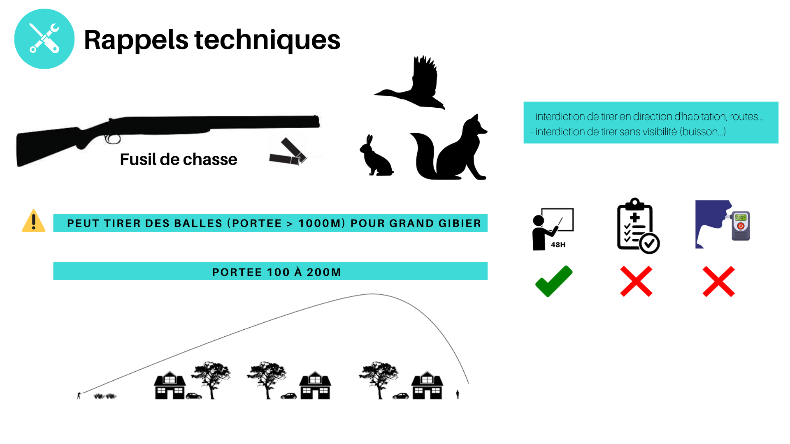
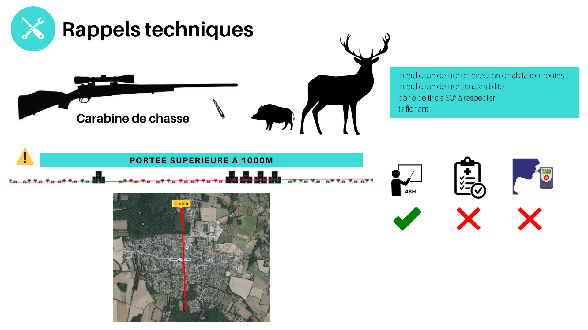
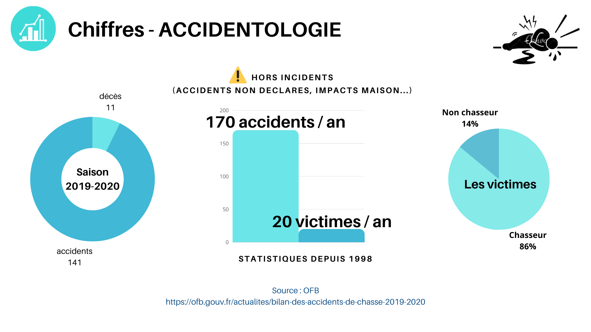

#### Désaccord citoyen
La pratique de la chasse est un débat citoyen qui revient cycliquement sur le devant de la scène médiatique et politique. Les dernières actualités ont tragiquement ravivé ce dernier.

#### Volontée publique 
Les différentes analyses de l’opinion citoyenne montrent depuis une dizaine d’années, que la majorité des Français souhaitent un ajustement de cette pratique afin de s’accorder avec leurs exodes vers les campagnes, les lois européennes et leurs volontés écologiques.
 
#### Elus
Dans ce nouveau contexte,  les élus, chargés de représenter l'avis majoritaire, ne peuvent plus jongler entre une minorité et une majorité , des décisions opportunistes et stratégiques doivent être prises.

### Infographie
Infographie avec chiffres. Chaque donnée est issue d’une source officielle, les sources sont citées.
*L'auteur de cette infographie est lui-même détenteur du permis de chasse.*

